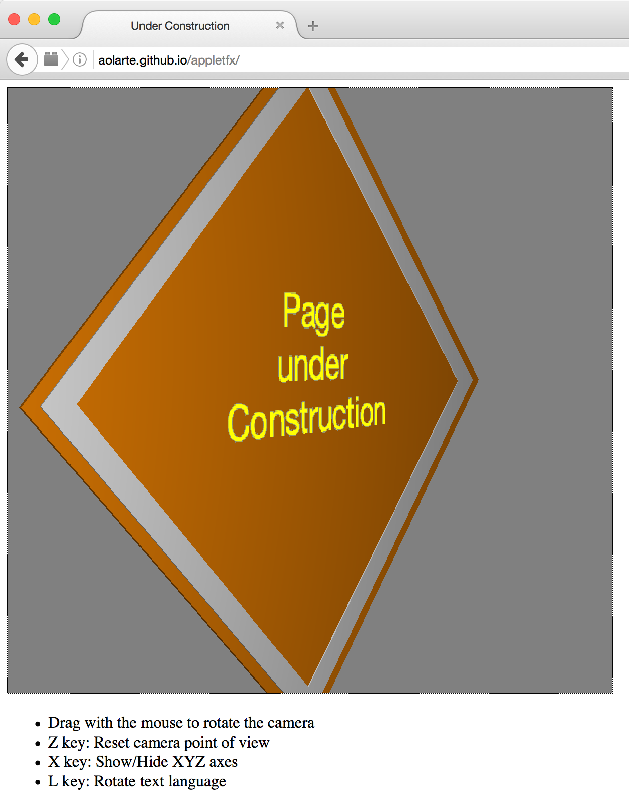

# appletfx

This is a simple Java Applet using JavaFX 2 to create 3d Graphics.
This is based on the on the official [Oracle tutorial for JavaFX](https://docs.oracle.com/javase/8/javafx/graphics-tutorial/sampleapp3d.htm). JavaFX is the latest and greatest Java technology for client UIs, yet it plays quite nicely inside an applet (given all of the applet's restrictions, of course).

You can see the applet in action [here](http://aolarte.github.io/appletfx/)

You need to have a Java enabled browser (like Firefox) and white list the the site "http://aolarte.github.io/appletfx/" in the "Security" tab of the Java Control Panel:

The end result looks something like this:
